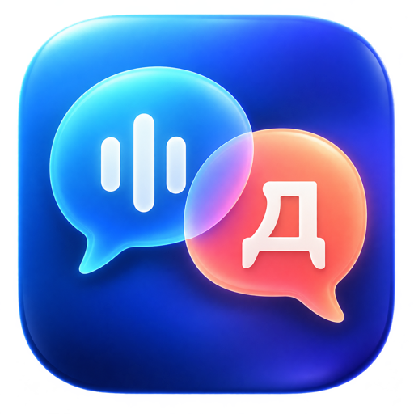

<p align="center">
  
</p>

<h1 align="center">Speech Provider</h1>

<p align="center">
  Live, on-device speech recognition and translation for macOS conversations.
</p>

<p align="center">
  <a href="https://github.com/AlexToros/SpeechProvider/releases/latest"><strong>Download the latest release</strong></a>
  ·
  <a href="#installation">Installation</a>
  ·
  <a href="#system-requirements">Requirements</a>
</p>

<p align="center">
  
  <a href="https://github.com/AlexToros/SpeechProvider/releases"></a>
</p>

Speech Provider listens to your call's system audio and your microphone as separate sources, transcribes speech locally on your Mac, detects the other person's language, and translates it into a selected target language. The target defaults to your macOS system language. It is made for calls, interviews, meetings, and everyday conversations where low latency and privacy matter.

Audio is not recorded or stored. The Whisper model is downloaded once on first use and reused afterwards.

## Latest release

**[Download Speech Provider for macOS](https://github.com/AlexToros/SpeechProvider/releases/latest)**

The release page contains a ZIP archive with `Speech Provider.app`. New tagged versions are built and published automatically by GitHub Actions.

## Highlights

- Capture all system audio or choose a specific application's audio.
- Keep the remote side and your microphone as separate conversation streams.
- Automatically detect the remote speaker's language and adapt the source language selector while the conversation is running.
- Default the target language to the current macOS system locale, with a dropdown to change it at any time.
- Translate a typed Russian reply into the other person's language — press Enter to send it.
- Mirror the complete remote-audio transcript in a resizable, always-on-top overlay. The original text appears as soon as Whisper finishes a phrase; the translation is filled in afterwards without blocking later captions.
- Choose whether the overlay is visible to screen capture.
- Tune phrase length with a silence-duration slider.
- Use either macOS on-device translation or the optional local NLLB backend.

## System requirements

| Requirement | Minimum |
| --- | --- |
| Hardware | Apple Silicon Mac |
| Operating system | macOS 26.4 or newer |
| Permissions | Screen Recording for system audio; Microphone for your side of the conversation |
| Internet | Required only for first-time model and language-pack downloads |

Speech Provider uses the current Apple Translation framework, which is why macOS 26.4 is the minimum supported version.

## Installation

1. [Download the latest ZIP archive](https://github.com/AlexToros/SpeechProvider/releases/latest).
2. Unzip it and move `Speech Provider.app` to `/Applications`.
3. Open the app and grant the requested Screen Recording and Microphone permissions.

Release builds are ad-hoc signed, not notarized with an Apple Developer certificate. If Gatekeeper blocks the first launch, Control-click the app in Finder, choose **Open**, then confirm the dialog. You can also allow it in **System Settings → Privacy & Security**.

## First launch and downloads

The app deliberately keeps large models out of the release archive. On first use it may download the following components:

1. **Whisper recognition model.** Speech Provider downloads and warms up the local Whisper model. The launch screen shows the current stage. It is not downloaded again on future launches.
2. **macOS translation language packs.** With the default system translation backend, the only default pair is English ↔ your macOS system language. Speech Provider does not request a bundle of languages up front. If Whisper detects another language during a call, or if you choose another target language, macOS may ask for that specific pair when it is first needed. Confirm the system prompt once; macOS reuses the package later.
3. **Optional NLLB translation model.** Selecting the local NLLB backend makes the app create an isolated Python environment and download its translation model. Its status is shown in the app.

Once the required models and language packs are installed, recognition and translation run without an internet connection.

### Download locations

| Component | Location |
| --- | --- |
| Whisper `large-v3-turbo` | `~/Documents/huggingface/models/argmaxinc/whisperkit-coreml/openai_whisper-large-v3-v20240930_turbo/` |
| NLLB Python environment | `~/Library/Application Support/SpeechProvider/nllb-venv/` |
| NLLB model | `~/Library/Application Support/SpeechProvider/Models/nllb-200-distilled-600M-ct2/` |
| Apple Translation language packs | Managed by macOS. Speech Provider does not choose or modify their location. |

Deleting the Whisper or NLLB folders frees disk space, but the corresponding component will be downloaded again when it is next needed.

## How it works

| Job | Technology |
| --- | --- |
| Interface | SwiftUI + AppKit |
| System audio capture | ScreenCaptureKit |
| Microphone capture | AVAudioEngine |
| Speech recognition | WhisperKit, Core ML, Whisper `large-v3-turbo` |
| Language detection | Whisper |
| Default translation | Apple Translation on-device language packs |
| Optional translation | NLLB-200 through CTranslate2 |
| Overlay | Non-activating `NSPanel` |

Whisper can distinguish **your** stream from the **remote** stream because they are captured separately. It does not perform speaker diarization: several people mixed into the same system-audio stream are not automatically identified by name.

## Development

Xcode 27 and the macOS 27 SDK are required to build the project locally.

```zsh
swift test
swift run
```

Build an installable app archive locally:

```zsh
zsh scripts/package-macos-app.sh
```

The resulting ZIP is written to `dist/`, which is intentionally ignored by Git.

## Continuous delivery

The [Build macOS release](.github/workflows/release.yml) workflow runs manually and for every `v*` tag.

- Every run executes the test suite and uploads a ZIP artifact.
- A tag such as `v1.2.3` also creates a GitHub Release and attaches the ZIP.
